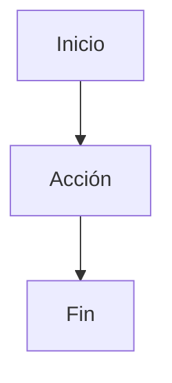

# FLOW-<MOD>-001 · <Nombre>

## Actor
<rol>

## Precondiciones
- <>

## Flujo principal
1. <>
2. <>

## Flujos alternos
### A1 · <nombre>
1. <>

## Errores
- <condición> → <respuesta>

## Diagrama

## Requisitos relacionados
- RF-...
