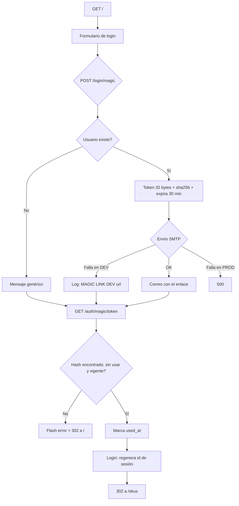

# FLOW-AUT-001 · Acceso al panel mediante enlace de un solo uso

## Control del documento

| Campo | Valor |
|---|---|
| Estado | ANALYZED |
| Responsable | Dev owner |
| Última actualización | 2026-09-30 |
| Versión relacionada | 2278659, 5b4f99b |

## Actor
Administrador (usuario registrado en `users`).

## Precondiciones
- El correo está registrado.
- `SESSION_DRIVER=cookie` y `APP_KEY` configurados (`.env`).
- El correo sale por SMTP; en DEV, si el envío falla, la URL se registra en el log.

## Flujo principal
1. El usuario abre `/` y la UI muestra solo el campo de correo.
2. Envía `POST /login/magic` con el correo (validado: 1–254 caracteres, formato email).
3. El controller busca el usuario; si existe genera un token de 32 bytes y guarda
   `sha256(token)`, `expires_at = ahora + 30 min`.
4. Envía el correo con el enlace `{APP_URL}/auth/magic/{token}`.
5. Responde con el mensaje genérico y redirige atrás (flash `success`).
6. El usuario abre el enlace: `GET /auth/magic/:token`.
7. El controller busca la fila con `used_at IS NULL` y `expires_at` vigente.
8. Escribe `used_at`, inicia sesión con el guard `web` (lo que regenera el identificador de
   sesión) y redirige a `/skus`.
9. La UI muestra el panel: el middleware de Inertia comparte `user` y el layout pinta el menú
   lateral con sus 7 enlaces.

## Flujos alternos

### A1 · El correo no está registrado
1. Se omite la creación del token y el envío.
2. La respuesta es **la misma** que en el flujo principal (mensaje genérico).
3. El usuario no puede distinguir el caso.

### A2 · El enlace expiró
1. `expires_at - ahora <= 0`.
2. Flash de error y redirect a `/`.
3. No se crea sesión.

### A3 · El enlace ya se usó
1. La fila tiene `used_at` informado, por lo que el filtro `whereNull('used_at')` no la devuelve.
2. Flash de error y redirect a `/`.

### A4 · El enlace no existe
1. El `token_hash` calculado no coincide con ninguna fila.
2. Mismo tratamiento que A2/A3 (mensaje indistinguible).

### A5 · El envío de correo falla
- **En DEV**: se registra el error y se escribe `[MAGIC LINK DEV] {url}` en el log; la fila en
  `magic_links` ya existe y la respuesta es el mensaje genérico.
- **En producción**: se relanza el error y el usuario recibe 500.

### A6 · El usuario ya tiene sesión
1. `middleware.guest()` detecta la sesión y redirige a `/skus`.
2. No se envía ningún correo.

### A7 · Una ruta protegida se pide sin sesión
1. `middleware.auth()` falla y redirige a `/` con la URL pretendida guardada en sesión.

### A8 · Dos peticiones simultáneas con el mismo token
1. Ambas pueden superar `used_at IS NULL` porque la comprobación y la escritura no son atómicas.
2. Ambas podrían iniciar sesión.

## Errores

| Condición | Respuesta | Evidencia en código |
|---|---|---|
| Token inválido / expirado / ya usado | 302 a `/` + flash de error | `magic_link_controller.ts:59-62` |
| SMTP caído en producción | 500 (el error se relanza) | `magic_link_controller.ts:40` |
| SMTP caído en desarrollo | 200, mensaje genérico, URL en el log | `magic_link_controller.ts:36-38` |
| `POST /logout` sin token CSRF válido | 302 atrás + flash `Invalid or expired CSRF token`; **la sesión sobrevive** | `@adonisjs/shield` `E_BAD_CSRF_TOKEN` |
| Sin sesión al pedir ruta protegida | 302 a `/` con URL pretendida | `auth_middleware.ts:22` |

## Diagrama

## Requisitos relacionados
- RF-AUT-001, RF-AUT-002, RF-AUT-003
- BR-AUT-001, BR-AUT-002, BR-AUT-003, BR-AUT-004, BR-AUT-005, BR-AUT-006
- AC-AUT-001 … AC-AUT-007
- FEATURE-002
