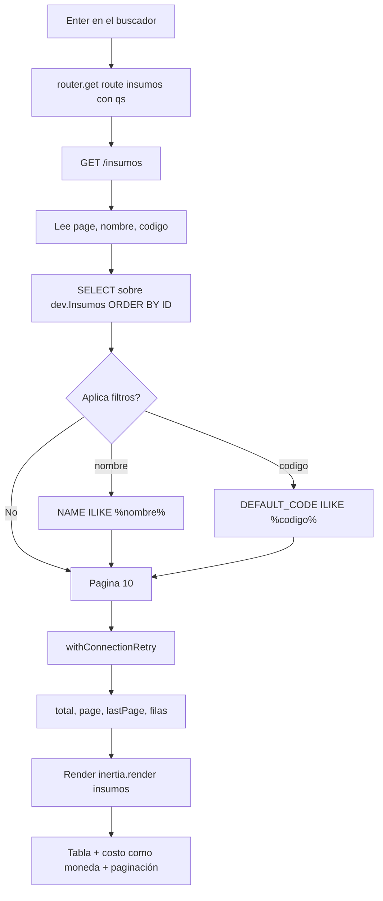

# FLOW-INS-001 · Consultar el catálogo de insumos

## Control del documento

| Campo | Valor |
|---|---|
| Estado | ANALYZED |
| Responsable | Dev owner |
| Última actualización | 2026-09-30 |
| Versión relacionada | 2278659, 5b4f99b |

## Actor
Administrador autenticado.

## Precondiciones
- Sesión activa (`middleware.auth()` en el grupo de `/insumos`).
- `SUPABASE_DB_URL` válido y **con contraseña incluida**; proyecto Supabase accesible.
- La conexión `supabase` tiene `searchPath: ['dev','public']`, pool acotado y keepalive.

## Flujo principal
1. El usuario pulsa "Insumos" en el sidebar y navega a `route('insumos')` → `GET /insumos`.
2. `InsumosController.index` lee los query params `page` (por defecto 1), `nombre` y `codigo`.
3. Compone la consulta: `SELECT ID, NAME, DEFAULT_CODE, MARCA, CANTIDAD, UNIT_COST` con
   `ORDER BY ID ASC`.
4. Si hay `nombre`, añade `WHERE NAME ILIKE '%nombre%'`; si hay `codigo`,
   `WHERE DEFAULT_CODE ILIKE '%codigo%'`. Los términos se escapan (`%` y `_`).
5. Ejecuta `paginate(page, 10)` dentro de `withConnectionRetry()`: dos consultas (conteo + página).
6. Renderiza `insumos` con datos planos: filas, `total`, `page`, `lastPage`, `nombre`, `codigo`.
7. La página pinta la tabla (10 filas), el total con separador de miles, el costo como moneda y
   la paginación calculada sobre `lastPage`.

## Búsqueda
1. El usuario escribe en "Buscar nombre" y/o "Buscar ID".
2. El `<form>` **no tiene botón submit**: la página intercepta `onKeyDown` y al pulsar Enter
   navega a `route('insumos')` con `qs: { nombre, codigo }`.
   - Motivo: un formulario con dos o más campos de texto y sin submit no hace *implicit
     submission* en HTML.
3. La URL queda como `/insumos?nombre=...&codigo=...`, por lo que la búsqueda es compartible y
   sobrevive a un refresco.
4. Cada cambio de página reutiliza los filtros vigentes: `qs: { page }` combinado con los
   filtros ya presentes.

## Flujos alternos

### A1 · Sin coincidencias
1. El conteo devuelve 0.
2. Se renderiza la tabla vacía con el total en 0, sin error de servidor.

### A2 · Supabase cerró la conexión por inactividad
1. La primera consulta falla con un error de conexión.
2. `withConnectionRetry()` reintenta **una vez**; el pool ya descartó el socket muerto, así que
   el segundo intento usa una conexión nueva.
3. La respuesta es 200 con datos.
4. Si también falla el reintento, el error sube al handler.

### A3 · El campo "ID" se usa con el identificador numérico
1. El filtro busca en `DEFAULT_CODE`, no en `ID`.
2. El usuario ve 0 resultados aunque exista el registro: es el comportamiento fijado por diseño.

### A4 · El usuario escribe `%` o `_`
1. Los comodines se escapan, así que se buscan literalmente.
2. El catálogo no se devuelve completo.

### A5 · Página fuera de rango
1. Se ejecuta el `OFFSET` correspondiente y se devuelve la página vacía con su número.

## Errores

| Condición | Respuesta | Evidencia en código |
|---|---|---|
| Sin sesión | 302 a `/` con URL pretendida | `auth_middleware.ts:22` |
| Conexión caída dos veces | Error del driver → página de error 500 (en DEV, con detalle) | `with_connection_retry.ts`, `exceptions/handler.ts:10,23-26` |
| `SUPABASE_DB_URL` sin contraseña | `SASL: SCRAM-SERVER-FIRST-MESSAGE: client password must be a string` | Configuración, no código |
| Catálogo inaccesible | La consulta falla y el error sube al handler | `exceptions/handler.ts:17,23-26` |

## Diagrama

## Requisitos relacionados
- RF-INS-001 … RF-INS-005
- BR-INS-001 … BR-INS-006
- AC-INS-001 … AC-INS-011
- FEATURE-001
- [Diagrama de datos](../../04-database/er-diagram.md)

## Brechas

- No hay ordenamiento por columna: "Ordenar" es texto fijo en la UI.
- "Última actualización" muestra un texto fijo; existe `modified_at` sin usar.
- El refresco de la tabla y el ícono de la fila no tienen comportamiento.
- Cada navegación ejecuta dos consultas a Supabase (conteo + página); sin caché para un catálogo
  de ~5,060 filas es aceptable, pero no lo es si el catálogo crece un orden de magnitud.
