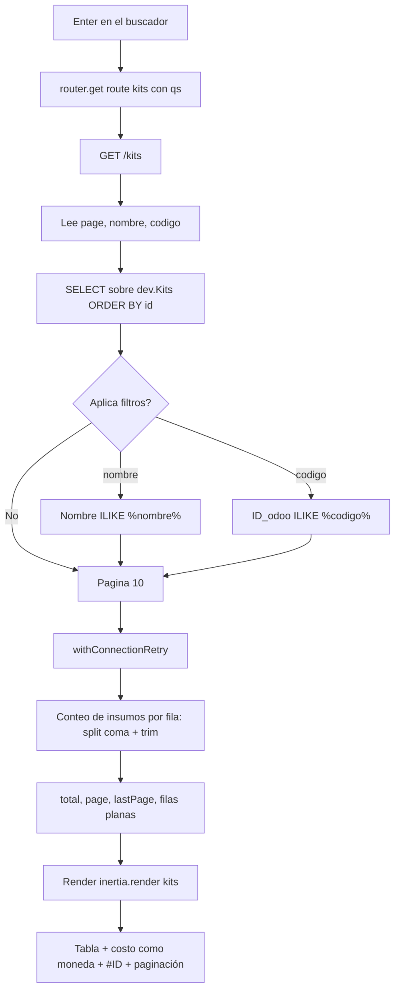

# FLOW-KIT-001 · Consultar el catálogo de kits

## Control del documento

| Campo | Valor |
|---|---|
| Estado | ANALYZED |
| Responsable | Dev owner |
| Última actualización | 2026-09-30 |
| Versión relacionada | (pendiente de commit) |

## Actor
Administrador autenticado.

## Precondiciones
- Sesión activa (`middleware.auth()` en el grupo de `/kits`).
- `SUPABASE_DB_URL` válido y **con contraseña incluida**; proyecto Supabase accesible.
- La conexión `supabase` tiene `searchPath: ['dev','public']`, pool acotado y keepalive.

## Flujo principal
1. El usuario pulsa "Kits" en el sidebar y navega a `route('kits')` → `GET /kits`.
2. `KitsController.index` lee los query params `page` (por defecto 1), `nombre` y `codigo`.
3. Compone la consulta: `SELECT id, "Nombre", "ID_odoo", "Costo", "Insumos"` con `ORDER BY id ASC`.
4. Si hay `nombre`, añade `WHERE "Nombre" ILIKE '%nombre%'`; si hay `codigo`,
   `WHERE "ID_odoo" ILIKE '%codigo%'`. Los términos se escapan (`%` y `_`).
5. Ejecuta `paginate(page, 10)` dentro de `withConnectionRetry()`: dos consultas (conteo + página).
6. Por cada fila calcula el conteo de insumos: parte `"Insumos"` por coma, recorta cada token y
   descarta los vacíos.
7. Renderiza `kits` con datos planos: filas, `total`, `page`, `lastPage`, `nombre`, `codigo`.
8. La página pinta la tabla, el costo como moneda, el identificador con `#` y la paginación
   calculada sobre `lastPage`.

## Interpretación de `"Insumos"`
La columna **no contiene un número**: es una lista de códigos de insumo separados por coma.

```
"M2625 , M1711 , M2203 , M0886 , I1019"
```

Cada código corresponde a `dev."Insumos"."DEFAULT_CODE"`. La columna "Insumos" de la tabla
muestra **cuántos** hay. Con las 40 filas actuales el recorte de cada token no altera ningún
conteo (verificado), pero protege ante una coma final o doble coma.

## Búsqueda
1. El usuario escribe en "Buscar kit por nombre" y/o "Buscar kit por ID".
2. El `<form>` **no tiene botón submit**: la página intercepta `onKeyDown` y al pulsar Enter
   navega a `route('kits')` con `qs: { nombre, codigo }`.
   - Motivo: un formulario con dos o más campos de texto y sin submit no hace *implicit
     submission* en HTML.
3. La URL queda como `/kits?nombre=...&codigo=...`, por lo que la búsqueda es compartible y
   sobrevive a un refresco.
4. Cada cambio de página reutiliza los filtros vigentes: `qs: { page }` combinado con los
   filtros ya presentes.

## Flujos alternos

### A1 · Sin coincidencias
1. El conteo devuelve 0.
2. Se renderiza la tabla vacía con el total en 0, sin error de servidor.

### A2 · Supabase cerró la conexión por inactividad
1. La primera consulta falla con un error de conexión.
2. `withConnectionRetry()` reintenta **una vez**; el pool ya descartó el socket muerto, así que
   el segundo intento usa una conexión nueva.
3. La respuesta es 200 con datos.
4. Si también falla el reintento, el error sube al handler.

### A3 · El campo "ID" se usa con el identificador numérico
1. El filtro busca en `"ID_odoo"`, no en `id`.
2. El usuario ve 0 resultados aunque exista el registro: es el comportamiento fijado por diseño,
   igual que en el catálogo de insumos.

### A4 · El usuario escribe `%` o `_`
1. Los comodines se escapan, así que se buscan literalmente.
2. El catálogo no se devuelve completo.

### A5 · Página fuera de rango
1. Se ejecuta el `OFFSET` correspondiente y se devuelve la página vacía con su número.

### A6 · Kit sin costo o sin insumos
1. Tres filas del catálogo de desarrollo (`id` 29, 31 y 32, todas con nombre `… PRUEBA`) tienen
   `Costo` e `Insumos` en `NULL`.
2. La celda de costo renderiza `—`, no `$0.00`: el kit no vale cero, falta el dato.
3. El conteo de insumos es `0`, nunca `NaN`.

## Errores

| Condición | Respuesta | Evidencia en código |
|---|---|---|
| Sin sesión | 302 a `/` con URL pretendida | `auth_middleware.ts:22` |
| Conexión caída dos veces | Error del driver → página de error 500 (en DEV, con detalle) | `with_connection_retry.ts`, `exceptions/handler.ts:10,23-26` |
| `SUPABASE_DB_URL` sin contraseña | `SASL: SCRAM-SERVER-FIRST-MESSAGE: client password must be a string` | Configuración, no código |
| Catálogo inaccesible | La consulta falla y el error sube al handler | `exceptions/handler.ts:17,23-26` |

## Diagrama



## Requisitos relacionados
- RF-KIT-001 … RF-KIT-006
- BR-KIT-001 … BR-KIT-007
- AC-KIT-001 … AC-KIT-014
- [FEATURE-005](../../features/FEATURE-005-kits-de-insumos.md)

## Brechas

- No hay ordenamiento por columna: "Ordenar" es texto fijo en la UI.
- "Última actualización" muestra un texto fijo; existe `created_at` sin usar. Decidido así de
  forma explícita: se verá más adelante.
- El modal "Nuevo kit" y el botón `···` por fila no tienen comportamiento: no hay ruta que
  escriba en el catálogo.
- No hay detalle por kit: no se puede ver *qué* insumos lo componen ni con qué cantidad. La
  columna `"Insumos"` solo guarda códigos y `public."Kits"."Cantidad requerida numero"` es la
  tabla que tiene esa información, pero todavía no se consulta.
- `Descripcion` se lee en el modelo pero no se muestra en ninguna parte de la vista.
- Cada navegación ejecuta dos consultas a Supabase (conteo + página); sin caché para 40 filas es
  aceptable.