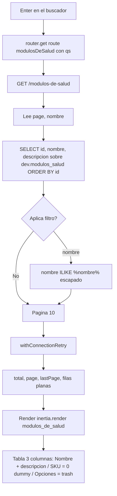

# FLOW-MSD-001 · Consultar el catálogo de módulos de salud

## Control del documento

| Campo | Valor |
|---|---|
| Estado | ANALYZED |
| Responsable | Dev owner |
| Última actualización | 2026-10-01 |
| Versión relacionada | (pendiente de commit) |

## Actor
Administrador autenticado.

## Precondiciones
- Sesión activa (`middleware.auth()` en el grupo de `/modulos-de-salud`).
- `SUPABASE_DB_URL` válido y **con contraseña incluida**; proyecto Supabase accesible.
- La conexión `supabase` tiene `searchPath: ['dev','public']`, pool acotado y keepalive.

## Flujo principal
1. El usuario pulsa "Módulos de salud" en el sidebar y navega a `route('modulosDeSalud')` →
   `GET /modulos-de-salud`.
2. `ModulosSaludController.index` lee los query params `page` (por defecto 1) y `nombre`.
3. Compone la consulta: `SELECT id, nombre, descripcion` sobre `dev.modulos_salud`, con
   `ORDER BY id ASC`.
4. Si hay `nombre`, añade `WHERE nombre ILIKE '%nombre%'` con `%` y `_` escapados.
5. Ejecuta `paginate(page, 10)` dentro de `withConnectionRetry()`: dos consultas (conteo + página).
6. Renderiza `modulos_de_salud` con datos planos: filas, `total`, `page`, `lastPage`, `nombre`.
7. La página pinta la tabla con 3 columnas (`Nombre`, `SKU`, `Opciones`) y la paginación calculada
   sobre `lastPage`. La celda `SKU` muestra **0**: es un dummy declarado en el frontend, no un dato
   del catálogo.

El SQL que genera la página es equivalente a:

```sql
SELECT m.id, m.nombre, m.descripcion
FROM dev.modulos_salud m
WHERE m.nombre ILIKE '%quirurgicos%'   -- solo si hay término, escapado
ORDER BY m.id ASC
LIMIT 10 OFFSET 0;
```

## La columna "SKU" no sale de la base
La referencia de diseño muestra bajo la cabecera "SKU" el número de SKUs de cada módulo. Ese dato
**no es derivable hoy**: `public."SKU"` tiene 255 filas pero ninguna columna ni FK que referencie
un módulo de salud, así que no hay forma de contar los SKUs que pertenecen a cada módulo. La
columna se implementa con `SKUS_DUMMY = 0` en `inertia/pages/modulos_de_salud.tsx`, declarado como
constante para que se note que es pendiente. Cuando exista la relación SKU↔módulo, la constante
desaparece y el conteo pasa a venir del controller.

## Columnas: 3, no 4
El HTML de referencia tiene tres columnas: `Nombre` (nombre + descripción como subtexto), `SKU` (el
número) y `Opciones` (el botón de acción, icono trash). La maqueta que existía en
`inertia/pages/modulos_de_salud.tsx` tenía cuatro: dejaba `SKU` vacía, movía el número a `Opciones` y
añadía una columna `Acciones` extra. Se adoptó el layout de la referencia.

## Búsqueda
1. El usuario escribe en "Buscar..." (placeholder del template).
2. El `<form>` **no tiene botón submit**: la página intercepta `onKeyDown` y al pulsar Enter
   navega a `route('modulosDeSalud')` con `qs: { nombre }`.
   - Con un solo input de texto el navegador sí haría *implicit submission*, pero se mantiene
     el patrón de insumos/kits/zonas por consistencia.
3. La URL queda como `/modulos-de-salud?nombre=...`, por lo que la búsqueda es compartible y
   sobrevive a un refresco.
4. Cada cambio de página reutiliza el filtro vigente: `qs: { page }` combinado con `nombre` ya
   presente.

## Flujos alternos

### A1 · Sin coincidencias
1. El conteo devuelve 0.
2. Se renderiza la tabla vacía con el total en 0, sin error de servidor.

### A2 · Supabase cerró la conexión por inactividad
1. La primera consulta falla con un error de conexión.
2. `withConnectionRetry()` reintenta **una vez**; el pool ya descartó el socket muerto, así que
   el segundo intento usa una conexión nueva.
3. La respuesta es 200 con datos.
4. Si también falla el reintento, el error sube al handler.

### A3 · El usuario escribe `%` o `_`
1. Los comodines se escapan, así que se buscan literalmente.
2. El catálogo no se devuelve completo.

### A4 · Página fuera de rango
1. Se ejecuta el `OFFSET` correspondiente y se devuelve la página vacía con su número.

### A5 · Solo hay una página de datos
1. Hoy existen 10 módulos y el `perPage` es 10: `lastPage` es 1 y el pie muestra `1-10 de 10`.
2. La paginación sigue funcional: cuando Odoo cargue el módulo número 11, aparecerán las páginas
   siguientes sin cambio de código.

### A6 · `descripcion` en `NULL`
1. La columna es nullable, así que puede venir vacía aunque hoy las 10 filas repitan el nombre.
2. La página no pinta el subtexto bajo el nombre en ese caso; el nombre sigue visible.

## Errores

| Condición | Respuesta | Evidencia en código |
|---|---|---|
| Sin sesión | 302 a `/` con URL pretendida | `auth_middleware.ts` |
| Conexión caída dos veces | Error del driver → página de error 500 (en DEV, con detalle) | `with_connection_retry.ts`, `exceptions/handler.ts` |
| `SUPABASE_DB_URL` sin contraseña | `SASL: SCRAM-SERVER-FIRST-MESSAGE: client password must be a string` | Configuración, no código |
| Catálogo inaccesible | La consulta falla y el error sube al handler | `exceptions/handler.ts` |

## Diagrama



## Requisitos relacionados
- RF-MSD-001 … RF-MSD-003
- BR-MSD-001 … BR-MSD-005
- AC-MSD-001 … AC-MSD-009
- [FEATURE-008](../../features/FEATURE-008-modulos-de-salud.md)

## Brechas

- El modal "Nuevo módulo de salud" y el botón trash por fila no tienen comportamiento: no hay ruta
  que escriba ni que borre en el catálogo.
- La columna "SKU" muestra un dummy. Falta la relación que permita contar los SKUs de cada módulo.
- `descripcion` y `created_at` se leen en el modelo pero no se muestran en ninguna parte de la
  vista.
- Solo hay 10 módulos: la paginación no se ejercita más allá de la página 1 con datos reales.
- Cada navegación ejecuta dos consultas a Supabase (conteo + página); sin caché para 10 filas es
  aceptable.