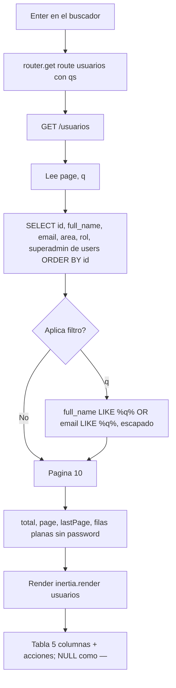

# FLOW-USR-001 · Consultar el catálogo de usuarios

## Control del documento

| Campo | Valor |
|---|---|
| Estado | ANALYZED |
| Responsable | Dev owner |
| Última actualización | 2026-10-01 |
| Versión relacionada | (pendiente de commit) |

## Actor
Usuario autenticado. Hoy **cualquier** usuario con sesión: no hay diferenciación por rol (ver
[roles y permisos](../../06-security/roles-permissions.md)).

## Precondiciones
- Sesión activa (`middleware.auth()` en el grupo de `/usuarios`).
- La migración `1780000000000_add_area_rol_superadmin_to_users_table` aplicada: `users` tiene
  `area`, `rol` y `superadmin`.
- `tmp/db.sqlite3` existe (conexión `sqlite`, la default).

## Flujo principal
1. El usuario pulsa "Usuarios" en el sidebar y navega a `route('usuarios')` → `GET /usuarios`.
2. `UsuariosController.index` lee los query params `page` (por defecto 1) y `q`.
3. Compone la consulta: `SELECT id, full_name, email, area, rol, superadmin` sobre `users`, con
   `ORDER BY id ASC`. **`password` queda fuera del `select`**.
4. Si hay `q`, añade `WHERE (full_name LIKE '%q%' ESCAPE '\' OR email LIKE '%q%' ESCAPE '\')` con
   `%` y `_` escapados.
5. Ejecuta `paginate(page, 10)`.
6. Renderiza `usuarios` con datos planos: filas, `total`, `page`, `lastPage`, `q`.
7. La página pinta la tabla con 5 columnas (`Nombre`, `Correo`, `Area`, `Rol`, `Superadmin`) y la
   paginación calculada sobre `lastPage`.

El SQL que genera la página es equivalente a:

```sql
SELECT id, full_name, email, area, rol, superadmin
FROM users
WHERE (full_name LIKE '%cordova%' ESCAPE '\' OR email LIKE '%cordova%' ESCAPE '\')  -- solo si hay término
ORDER BY id ASC
LIMIT 10 OFFSET 0;
```

### Por qué `ESCAPE '\'` es obligatorio aquí
`escapeLike()` escapa con backslash, que es el carácter de escape por defecto de `ILIKE` en
PostgreSQL. **SQLite no lo reconoce**: sin la cláusula `ESCAPE`, un `%` buscado seguiría siendo
comodín y el escapado sería un no-op. Medido el 2026-10-01 con `better-sqlite3`: el patrón `%\%`
(lo que produce `escapeLike('%')`) solo casa con una cadena que contenga un backslash literal
(`a\Xb`); no encuentra ni un `%` literal ni `a%b`. Con la cláusula, `LIKE '%\%%' ESCAPE '\'` sí
devuelve la fila con `50% descuento`. Por eso el filtro se hace con
`whereRaw("full_name LIKE ? ESCAPE '\\'", [term])` en vez de `where(..., 'like', term)`.

## La única fuente de usuarios es SQLite
Este es el único catálogo que **no** lee Supabase: los usuarios son los de la autenticación, que
viven en `users` de la conexión `sqlite` (la default). Por eso aquí **no** se usa
`withConnectionRetry()`: ese helper existe porque Supabase cierra conexiones inactivas y la consulta
va por red, mientras que SQLite es un archivo local. Supabase no tiene tabla de usuarios.

## Campos que hubo que añadir
`users` solo tenía `id`, `full_name`, `email`, `password`, `created_at` y `updated_at`. Para poder
mostrar las 5 columnas de la referencia se añadió una migración con tres columnas:

| Columna | Tipo | Por qué |
|---|---|---|
| `area` | `string` nullable | La referencia trae áreas (`TO`, `Dental`, `Planeación financiera`) |
| `rol` | `string` nullable | La referencia trae roles, a veces compuestos (`"Validador, Editar"`), por eso es texto libre y no un `enum` |
| `superadmin` | `boolean` not null, default `false` | En la referencia es una columna **separada** del rol (`User_TO` tiene `rol = "Validador, Editar"` y `Superadmin = yes`) |

`area`, `rol` y `superadmin` son **datos de pantalla**: nada en el servidor los lee para autorizar.

## Columnas: 5, no 6
La referencia de diseño trae seis cabeceras (`Nombre`, `Correo`, `Area`, `Rol`, `Superadmin`,
`Costo`), pero **"Costo" viene vacía en las 10 filas**: es residuo de haber copiado la plantilla de
kits. Se descartan esa columna y el valor que la maqueta no tenía. La columna de acciones se
mantiene con la cabecera vacía (`aria-label="Acciones"`), como en la maqueta.

## Búsqueda
1. El usuario escribe en "Buscar..." (placeholder del template).
2. El `<form>` **no tiene botón submit**: la página intercepta `onKeyDown` y al pulsar Enter
   navega a `route('usuarios')` con `qs: { q }`.
   - Con un solo input de texto el navegador sí haría *implicit submission*, pero se mantiene el
     patrón de insumos/kits/zonas/módulos por consistencia.
3. La URL queda como `/usuarios?q=...`, por lo que la búsqueda es compartible y sobrevive a un
   refresco.
4. Cada cambio de página reutiliza el filtro vigente: `qs: { page }` combinado con `q` ya presente.

La búsqueda cubre **nombre y correo** a propósito: el alta por magic link no pide nombre, así que
`full_name` es `NULL` en muchas cuentas. Buscar solo por nombre dejaría fuera a casi todos.

## Flujos alternos

### A1 · Sin coincidencias
1. El conteo devuelve 0.
2. Se renderiza la tabla vacía con el total en 0, sin error de servidor.

### A2 · El usuario escribe `%` o `_`
1. `escapeLike()` los convierte en `\%` y `\_`, y la cláusula `ESCAPE '\'` los devuelve a literales.
2. El catálogo no se devuelve completo: solo aparecen las filas que contienen ese carácter.

### A3 · Página fuera de rango
1. Se ejecuta el `OFFSET` correspondiente y se devuelve la página vacía con su número.

### A4 · Solo hay una página de datos
1. Tras la limpieza de los usuarios de prueba queda 1 usuario y `perPage` es 10: `lastPage` es 1 y el
   pie muestra `1-1 de 1`.
2. La paginación sigue funcional: cuando se den de alta los usuarios número 11 en adelante,
   aparecerán las páginas siguientes sin cambio de código.

### A5 · `full_name`, `area` o `rol` en `NULL`
1. Las tres columnas son nullable. `full_name`, `area` y `rol` admiten `NULL`.
2. La página pinta `—` en esos campos, para que se distinga "vacío" de un valor real.
3. El correo nunca va vacío: `users.email` es `NOT NULL` y `UNIQUE`.

### A6 · Usuario sin sesión
1. `middleware.auth()` redirige a `/` conservando la URL pretendida.

## Errores

| Condición | Respuesta | Evidencia en código |
|---|---|---|
| Sin sesión | 302 a `/` con URL pretendida | `auth_middleware.ts` |
| `POST /usuarios` | 404: la ruta es `router.get`, no existe escritura | `start/routes.ts` |
| Migración no aplicada | `no such column: users.area` → 500 (en DEV, con detalle) | `database/migrations/` |
| `tmp/db.sqlite3` ausente | Error de conexión del driver → 500 | `config/database.ts` |

## Diagrama



## Requisitos relacionados
- RF-USR-001 … RF-USR-003
- BR-USR-001 … BR-USR-005
- AC-USR-001 … AC-USR-010
- [FEATURE-006](../../features/FEATURE-006-usuarios.md)
- [Usuarios (módulo)](../modules.md#usuarios-usr)

## Brechas

- El modal "Nuevo usuario" y el menú de editar/eliminar no tienen comportamiento: **no hay ruta
  que escriba ni borre usuarios**. La pregunta de quién da de alta a los usuarios sigue abierta y es
  la más urgente del proyecto.
- `area`, `rol` y `superadmin` **no autorizan nada**. `middleware.auth()` sigue siendo el único
  control, así que cualquier usuario autenticado ve el catálogo completo de correos.
- La limpieza de los 17 usuarios de prueba no queda en el repositorio: `tmp/db.sqlite3` está
  gitignored, así que en otro entorno habría que repetirla.
- Solo hay 1 usuario: la paginación no se ejercita más allá de la página 1 con datos reales.
- Cada navegación ejecuta dos consultas a SQLite (conteo + página); para 1 fila es irrelevante.
- Sin cobertura automatizada: la verificación fue una revisión manual en el navegador. Por
  indicación del usuario no se ejecutó el humo HTTP, así que los `TC-USR-*` de
  [casos de prueba](../../08-quality/test-cases.md) quedan pendientes y sin evidencia archivada.