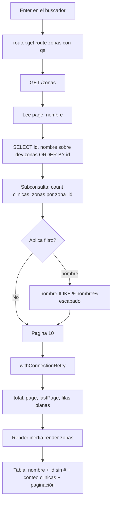

# FLOW-ZON-001 · Consultar el catálogo de zonas

## Control del documento

| Campo | Valor |
|---|---|
| Estado | ANALYZED |
| Responsable | Dev owner |
| Última actualización | 2026-09-30 |
| Versión relacionada | (pendiente de commit) |

## Actor
Administrador autenticado.

## Precondiciones
- Sesión activa (`middleware.auth()` en el grupo de `/zonas`).
- `SUPABASE_DB_URL` válido y **con contraseña incluida**; proyecto Supabase accesible.
- La conexión `supabase` tiene `searchPath: ['dev','public']`, pool acotado y keepalive.

## Flujo principal
1. El usuario pulsa "Zonas" en el sidebar y navega a `route('zonas')` → `GET /zonas`.
2. `ZonasController.index` lee los query params `page` (por defecto 1) y `nombre`.
3. Compone la consulta: `SELECT id, nombre` sobre `dev."zonas"`, con `ORDER BY id ASC`.
4. Añade una **subconsulta correlacionada** al `select`:
   `(SELECT count(*)::int FROM public.clinicas_zonas cz WHERE cz.zona_id = "zonas"."id") AS clinicas`.
5. Si hay `nombre`, añade `WHERE nombre ILIKE '%nombre%'` con `%` y `_` escapados.
6. Ejecuta `paginate(page, 10)` dentro de `withConnectionRetry()`: dos consultas (conteo + página).
7. Renderiza `zonas` con datos planos: filas, `total`, `page`, `lastPage`, `nombre`.
8. La página pinta la tabla (nombre, `id` bajo el nombre sin `#`, conteo de clínicas) y la
   paginación calculada sobre `lastPage`.

## Por qué subconsulta correlacionada y no join
La columna "Clínicas" no está en `dev."zonas"`: viene de contar filas de
`public.clinicas_zonas`. La tentación es `join` + `groupBy`, pero **`paginate()` arma su total
con `clone().clearSelect().count('* as total')`**: con un join, ese conteo contaría filas de la
unión (clínicas × zonas) y no zonas. La subconsulta vive en el `select`, que `clearSelect()`
quita para el conteo, así que `total` sigue siendo el número de zonas. Verificado en
`@adonisjs/lucid/build/src/orm/query_builder/index.js` (`paginate`).

El SQL que genera la página es equivalente a:

```sql
SELECT z.id, z.nombre,
       (SELECT count(*)::int FROM public.clinicas_zonas cz WHERE cz.zona_id = z.id) AS clinicas
FROM dev.zonas z
WHERE z.nombre ILIKE '%nac%'   -- solo si hay término, escapado
ORDER BY z.id ASC
LIMIT 10 OFFSET 0;
```

## Búsqueda
1. El usuario escribe en "Buscar..." (placeholder del template).
2. El `<form>` **no tiene botón submit**: la página intercepta `onKeyDown` y al pulsar Enter
   navega a `route('zonas')` con `qs: { nombre }`.
   - Con un solo input de texto el navegador sí haría *implicit submission*, pero se mantiene
     el patrón de insumos/kits por consistencia.
3. La URL queda como `/zonas?nombre=...`, por lo que la búsqueda es compartible y sobrevive a un
   refresco.
4. Cada cambio de página reutiliza el filtro vigente: `qs: { page }` combinado con `nombre` ya
   presente.

## Flujos alternos

### A1 · Sin coincidencias
1. El conteo devuelve 0.
2. Se renderiza la tabla vacía con el total en 0, sin error de servidor.

### A2 · Supabase cerró la conexión por inactividad
1. La primera consulta falla con un error de conexión.
2. `withConnectionRetry()` reintenta **una vez**; el pool ya descartó el socket muerto, así que
   el segundo intento usa una conexión nueva.
3. La respuesta es 200 con datos.
4. Si también falla el reintento, el error sube al handler.

### A3 · El usuario escribe `%` o `_`
1. Los comodines se escapan, así que se buscan literalmente.
2. El catálogo no se devuelve completo.

### A4 · Página fuera de rango
1. Se ejecuta el `OFFSET` correspondiente y se devuelve la página vacía con su número.

### A5 · Solo hay una página de datos
1. Hoy existen 2 zonas y el `perPage` es 10: `lastPage` es 1.
2. La paginación sigue funcional: cuando Odoo cargue más zonas, aparecerán las páginas siguientes
   sin cambio de código.

## Errores

| Condición | Respuesta | Evidencia en código |
|---|---|---|
| Sin sesión | 302 a `/` con URL pretendida | `auth_middleware.ts` |
| Conexión caída dos veces | Error del driver → página de error 500 (en DEV, con detalle) | `with_connection_retry.ts`, `exceptions/handler.ts` |
| `SUPABASE_DB_URL` sin contraseña | `SASL: SCRAM-SERVER-FIRST-MESSAGE: client password must be a string` | Configuración, no código |
| Catálogo inaccesible | La consulta falla y el error sube al handler | `exceptions/handler.ts` |

## Diagrama



## Requisitos relacionados
- RF-ZON-001 … RF-ZON-003
- BR-ZON-001 … BR-ZON-005
- AC-ZON-001 … AC-ZON-010
- [FEATURE-007](../../features/FEATURE-007-catalogo-zonas.md)

## Brechas

- El modal "Nueva zona" y el botón `···` por fila no tienen comportamiento: no hay ruta que
  escriba en el catálogo.
- `descripcion` y `created_at` se leen en el modelo pero no se muestran en ninguna parte de la
  vista.
- Solo hay 2 zonas: la paginación no se ejercita más allá de la página 1 con datos reales.
- No hay asignación de clínicas a zonas desde la app: `public.clinicas_zonas` se lee, pero nadie
  escribe.
- Cada navegación ejecuta dos consultas a Supabase (conteo + página); sin caché para 2 filas es
  aceptable.
