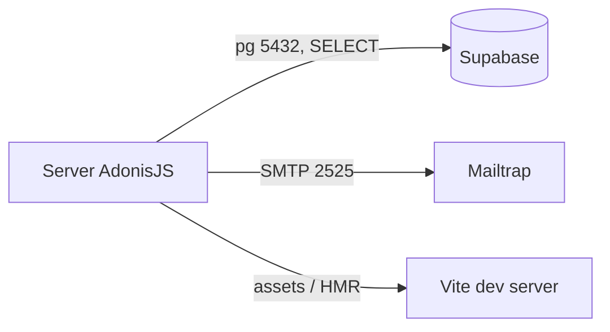

# Integraciones

## Control del documento

| Campo | Valor |
|---|---|
| Estado | ANALYZED |
| Responsable | Dev owner |
| Última actualización | 2026-09-30 |
| Versión relacionada | 2332e22 |

| Sistema | Propósito | Protocolo | Auth | Dirección | Timeout/Retry | Owner |
|---|---|---|---|---|---|---|
| Supabase (PostgreSQL) | Fuente de verdad del catálogo de insumos (solo lectura) | PostgreSQL sobre TCP, `pg` 8.x, TLS (`ssl.rejectUnauthorized: false`) | `SUPABASE_DB_URL` con usuario y contraseña, obligatoria | **Salida** | Pool: `min 0`, `max 5`, `idleTimeoutMillis 30 s`, `acquire`/`createTimeout 10 s`, `propagateCreateError`. Reintento de aplicación: 1 vía `withConnectionRetry`. Timeout de statement: el del driver | Dev owner |
| Mailtrap (SMTP) | Entregar el enlace de acceso por correo | SMTP sobre TCP, puerto 2525, sin `secure` (STARTTLS oportunista) | `SMTP_USERNAME`/`SMTP_PASSWORD` en `.env` | **Salida** | Ninguno configurado. Si falla: en DEV se registra y se continúa; en PROD se relanza (500) | Dev owner |
| Vite dev server | Servir los assets en desarrollo (HMR) | HTTP interno, mismo origen | Ninguna | Interna | Ninguno | Dev owner |

## Notas de configuración relevantes

- La conexión `supabase` declara `keepAlive: true` y `keepAliveInitialDelayMillis: 30_000`: Supabase cierra conexiones ociosas y esto detecta el socket muerto a nivel TCP antes de que la consulta fallé.
- `searchPath: ['dev','public']` se traduce a `set search_path to 'dev','public'` en cada conexión, por eso los modelos no declaran `static schema`.
- `ssl.rejectUnauthorized: false` se acepta porque Supabase usa certificado con cadena válida; queda como decisión a revisar si se endurece la conexión.
- El SMTP **no** fija `secure`/`requireTLS`: el cifrado depende de que el servidor lo negocie.

## Diagrama

## Brechas

- **Sin timeout ni reintento en el envío de correo**: si SMTP se demora, la petición de login cuelga hasta agotar el timeout del servidor HTTP.
- **Sin circuit breaker** hacia Supabase: si el proyecto está caído, cada visita a `/insumos` paga el intento fallido.
- **Sin observabilidad de integraciones**: no hay métricas ni trazas de consultas ni de correos; solo logs del servidor.
- **Sin rotación de credenciales documentada** para `SUPABASE_DB_URL`, SMTP ni `APP_KEY` (ver [secrets-management](../06-security/secrets-management.md)).
- `rejectUnauthorized: false` desactiva la validación del certificado del servidor de BD.

## Referencias
- [ADR-001 · pg + Lucid en vez de supabase-js](adr/ADR-001-driver-postgres-lucid.md)
- [ADR-004 · Catálogo de solo lectura](adr/ADR-004-catalogo-solo-lectura.md)
