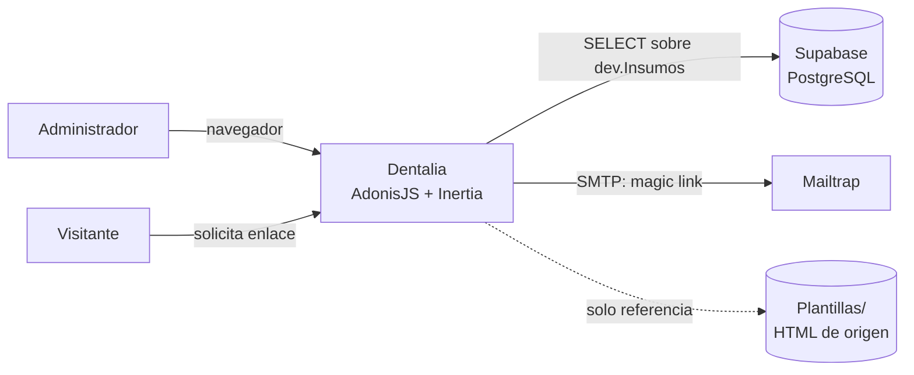

# Contexto del sistema

## Control del documento

| Campo | Valor |
|---|---|
| Estado | ANALYZED |
| Responsable | Dev owner |
| Última actualización | 2026-09-30 |
| Versión relacionada | 2332e22 |

## Actores

| Actor | Tipo | Interacción |
|---|---|---|
| Administrador | Humano, autenticado | Navega el panel: SKUs, Familias, Insumos, Kits, Usuarios, Zonas, Módulos de salud. Hoy **Insumos**, **Kits**, **Zonas**, **Módulos de salud** y **Usuarios** tienen datos reales |
| Visitante | Humano, sin sesión | Única pantalla de acceso: solicita un enlace por correo |
| Cliente HTTP / navegador | Sistema | Único consumidor de la aplicación. No hay integraciones de sistema a sistema |

## Sistemas externos

| Sistema | Propósito | Dirección |
|---|---|---|
| **Supabase (PostgreSQL)** | Catálogo de insumos, tabla `dev."Insumos"` (~5,060 filas). Solo lectura | Salida |
| **Mailtrap (SMTP)** | Entrega del enlace de acceso. Credenciales SMTP en `.env` | Salida |
| **Catálogo Dentalia original (Bubble)** | Referencia de diseño. Volcada en `Plantillas/<seccion>/` como HTML + assets. **No es dependencia en ejecución** | Ninguna |

## Diagrama

## Frontera del sistema

- **Entra**: peticiones HTTP desde el navegador (mismo origen). En DEV el middleware de CORS
  refleja **cualquier** origen con `credentials: true` (`config/cors.ts:21`); en producción la
  allowlist está vacía, lo que bloquea el acceso cross-origin.
- **Sale**: consultas SQL de lectura a Supabase y correos SMTP salientes.
- **No hay**: API REST pública, webhooks, colas, workers ni integraciones con terceros.

## Supuestos

- La red del servidor tiene salida a `*.supabase.co:5432` y al SMTP de Mailtrap.
- El catálogo de Supabase es la fuente de verdad y su esquema se administra fuera de este
  repositorio (la conexión declara `migrations.paths: []`).

## Brechas

- **No hay segundo actor de sistema**: el diseño no contempla integraciones, por lo que
  `providers/api_provider.ts` y el registro de Tuyau están montados sin uso.
- **No hay staging ni producción definidos**: todo el sistema opera hoy en DEV.
- No hay actor interno (soporte, administrador de sistemas) documentado para operación.
