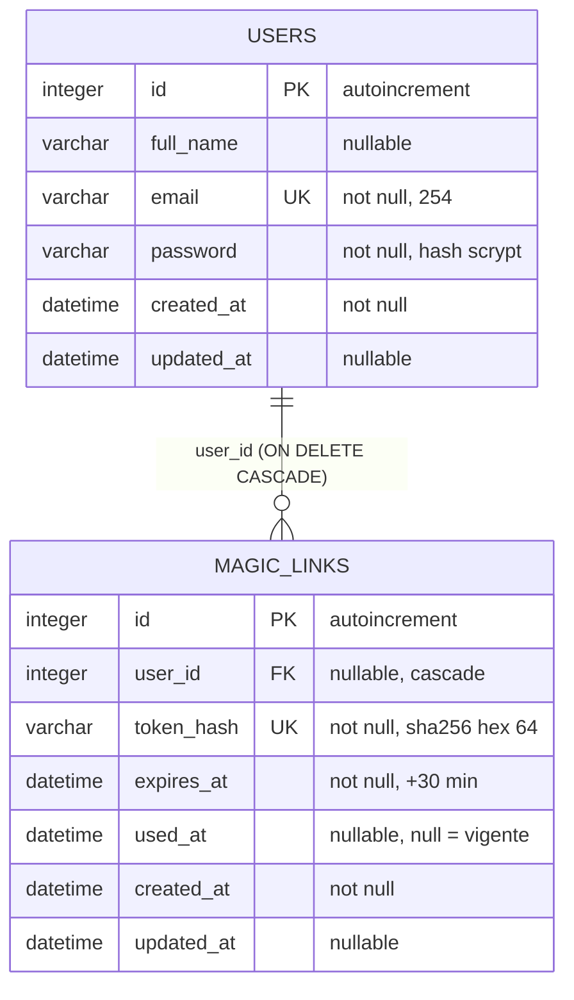
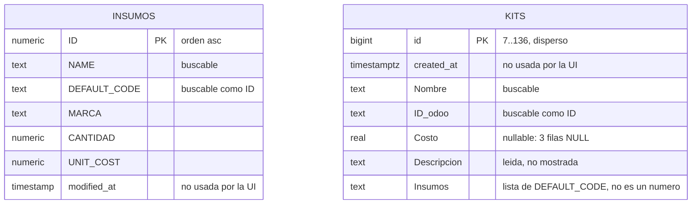
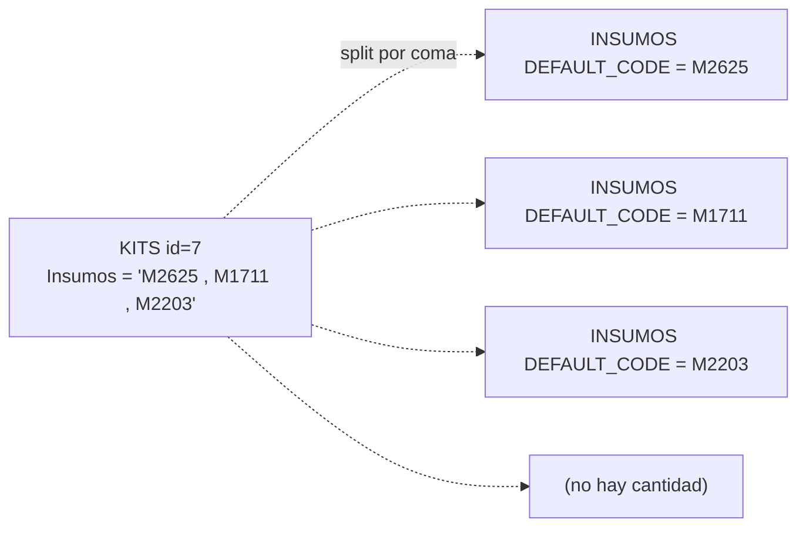

# Diagrama entidad-relación

## Control del documento

| Campo | Valor |
|---|---|
| Estado | ANALYZED |
| Responsable | Dev owner |
| Última actualización | 2026-09-30 |
| Versión relacionada | 2332e22 |

El modelo se divide en **dos bases de datos sin relación entre sí**. Por eso el diagrama se
presenta en dos bloques y no en un único grafo.

## Base de datos de autenticación (SQLite)

Leyenda: `PK` clave primaria, `FK` clave foránea, `UK` único.

### Cardinalidad
- Un `USERS` tiene 0..N `MAGIC_LINKS`. El cero es real: un usuario recién creado por `/signup`
  no tiene enlaces hasta que pide uno.
- Un `MAGIC_LINKS` pertenece a 0..1 `USERS` porque la columna es nullable en el esquema (aunque la
  aplicación siempre la escribe).

## Base de datos de catálogo (Supabase, solo lectura)

### Sin relación entre `INSUMOS` y `KITS`
No hay clave foránea. La composición de un kit se codifica **dentro del texto** de
`KITS."Insumos"`, como códigos separados por coma:

La consecuencia es que no se puede validar desde la base que un código exista, ni conocer la
cantidad de cada insumo. Esa información vive en `public."Kits"`, tabla desnormalizada con
`id_kit`, `id_insumo` y `Cantidad requerida numero`, que la aplicación todavía no consulta.

`INSUMOS` y `KITS` son **entidades aisladas**: no tienen claves foráneas hacia otras tablas de la
aplicación y no se relacionan con `USERS`. No hay forma de saber, desde este repositorio, con qué
otras tablas del catálogo se enlazan (propiedad del equipo dueño de Supabase).

## Entidades que NO existen en el modelo

| Concepto de la UI | ¿Entidad? | Nota |
|---|---|---|
| SKU | **No** | Pantalla `skus` con props `{}` |
| Familia | **No** | Pantalla `familias` con props `{}` |
| Detalle de insumos por kit | **No** | Existe `public."Kits"` en Supabase (con cantidades), pero la app solo lee `dev."Kits"` |
| Usuario de negocio (del catálogo) | **No** | `users` es solo auth; la pantalla `usuarios` está vacía |
| Zona | **No** | Pantalla `zonas` con props `{}` |
| Módulo de salud | **No** | Pantalla `modulos_de_salud` con props `{}` |
| Sesión | **No** | `SESSION_DRIVER=cookie`: vive en una cookie cifrada, no en una tabla |

## Referencias
- [Diccionario de datos](data-dictionary.md)
- [Diseño de base de datos](database-design.md)
