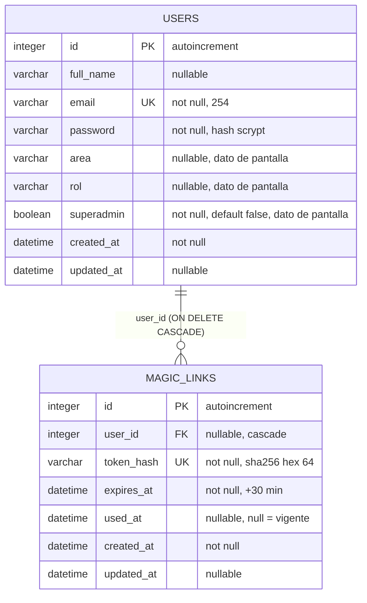
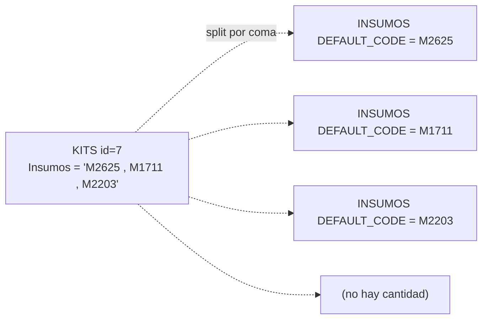
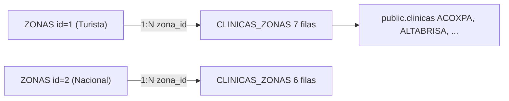
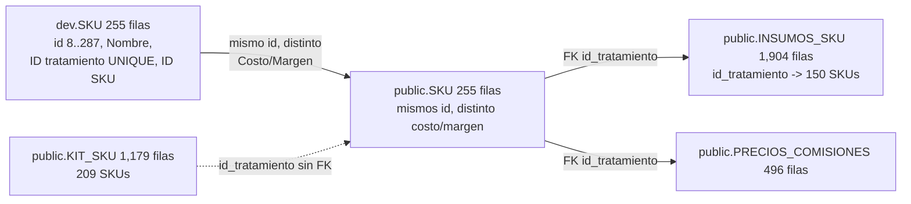
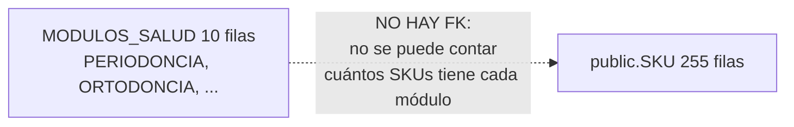

# Diagrama entidad-relación

## Control del documento

| Campo | Valor |
|---|---|
| Estado | ANALYZED |
| Responsable | Dev owner |
| Última actualización | 2026-10-02 |
| Versión relacionada | b69cb3d |

El modelo se divide en **dos bases de datos sin relación entre sí**. Por eso el diagrama se
presenta en dos bloques y no en un único grafo.

## Base de datos de autenticación (SQLite)

Leyenda: `PK` clave primaria, `FK` clave foránea, `UK` único.

### Cardinalidad
- Un `USERS` tiene 0..N `MAGIC_LINKS`. El cero es real: un usuario recién creado por `/signup`
  no tiene enlaces hasta que pide uno.
- Un `MAGIC_LINKS` pertenece a 0..1 `USERS` porque la columna es nullable en el esquema (aunque la
  aplicación siempre la escribe).

### `USERS` también es el catálogo de `/usuarios`
`USERS` cumple dos papeles: es la tabla de autenticación **y** la fuente del catálogo de usuarios.
Por eso `/usuarios` lee esta conexión y no Supabase, y no usa `withConnectionRetry()`.

`area`, `rol` y `superadmin` (añadidas el 2026-10-01) existen para poder mostrar las columnas de la
referencia de diseño. **No son entidades de autorización**: no hay `ROLES`, ni `PERMISSIONS`, ni
tabla puente, y nada las lee para decidir un acceso.

## Base de datos de catálogo (Supabase, solo lectura)

```mermaid
erDiagram
    INSUMOS {
        numeric ID PK "orden asc"
        text NAME "buscable"
        text DEFAULT_CODE "buscable como ID"
        text MARCA
        numeric CANTIDAD
        numeric UNIT_COST
        timestamp modified_at "no usada por la UI"
    }

    KITS {
        bigint id PK "7..136, disperso"
        timestamptz created_at "no usada por la UI"
        text Nombre "buscable"
        text ID_odoo "buscable como ID"
        real Costo "nullable: 3 filas NULL"
        text Descripcion "leida, no mostrada"
        text Insumos "lista de DEFAULT_CODE, no es un numero"
    }

    ZONAS {
        bigint id PK "1..2"
        text nombre "buscable"
        text descripcion "leida, no mostrada"
        real costo "existe pero la app no lo expone: NULL en las 2 filas"
        timestamptz created_at "no usada por la UI"
    }

    CLINICAS_ZONAS {
        bigint clinica_id FK "a public.clinicas.id"
        bigint zona_id FK "a public.zonas.id"
        timestamptz created_at
    }

    SKU {
        bigint id PK "8..287, disperso"
        text Nombre "buscable, admite NULL"
        bigint ID_tratamiento UK "columna real: ID tratamiento"
        text ID_SKU "buscable, admite NULL, no unico"
    }

    MODULOS_SALUD {
        bigint id PK "1..10, contiguo"
        text nombre "buscable"
        text descripcion "subtexto bajo el nombre"
        timestamptz created_at "no usada por la UI"
    }
```

Las entidades sin claves foráneas se dibujan igual como cajas sueltas, sin aristas: es el caso de
`INSUMOS`, `KITS`, `SKU` y `MODULOS_SALUD`, que la app lee pero entre las que no hay integridad
referencial. Lo que la app **no** consulta -las tablas de detalle en `public` que apuntan a
`public."SKU"`, y el duplicado `public."SKU"`- se detalla aparte en los diagramas de flujo de abajo,
porque no forma parte del modelo que la aplicación usa.

De `SKU` solo se dibujan las 4 columnas que lee la app: la tabla tiene **25** (precios, comisiones,
márgenes, costos, `sesiones`). De `MODULOS_SALUD` no se dibujan `id_modulo` ni `updated_at`, que
existen pero no se declaran a propósito. Las 25 y 6 columnas completas están en
[data-dictionary.md](data-dictionary.md).

Dos columnas de `SKU` llevan el nombre cambiado porque mermaid no admite espacios en los atributos de
un `erDiagram`: `ID_tratamiento` es `"ID tratamiento"` e `ID_SKU` es `"ID SKU"`. El nombre real está
en el comentario.

### Sin relación entre `INSUMOS` y `KITS`
No hay clave foránea. La composición de un kit se codifica **dentro del texto** de
`KITS."Insumos"`, como códigos separados por coma:

La consecuencia es que no se puede validar desde la base que un código exista, ni conocer la
cantidad de cada insumo. Esa información vive en `public."Kits"`, tabla desnormalizada con
`id_kit`, `id_insumo` y `Cantidad requerida numero`, que la aplicación todavía no consulta.

`INSUMOS` y `KITS` son **entidades aisladas**: no tienen claves foráneas hacia otras tablas de la
aplicación y no se relacionan con `USERS`.

### Relación real: `ZONAS` ↔ `CLINICAS_ZONAS`

A diferencia de insumos y kits, el catálogo de zonas **sí tiene una relación con FKs reales**
(verificadas en `information_schema`), aunque vive en el schema `public`:

- `public.clinicas_zonas.clinica_id → public."clinicas".id` y
  `public.clinicas_zonas.zona_id → public."zonas".id`. 13 filas, sin duplicados ni huérfanos.
- La app lee `dev."zonas"` (el `searchPath` pone `dev` primero; `public."zonas"` es un duplicado
  exacto) y **cuenta** las filas de `public.clinicas_zonas` por `zona_id` con una subconsulta
  correlacionada. No escribe en ninguna de las dos.
- Ojo: la FK de `zona_id` apunta a `public."zonas"`, no a `dev."zonas"`. Hoy son idénticas, pero
  son tablas distintas: si Odoo escribiera en una sola, el conteo y el listado podrían divergir.

### `SKU`: entidad casi aislada, con 2 FKs entrantes desde `public`

- `dev."SKU"` **no tiene ninguna FK** que entre ni salga (verificado en `information_schema`); solo
  `sku_pkey` y `sku_id_tratamiento_key` (`UNIQUE`).
- **Las FKs del entorno apuntan a `public`, no a `dev`**: `public."Insumos_SKU"` y
  `public.precios_comisiones` referencian `public."SKU"("ID tratamiento")`. `public.kit_sku` trae
  `id_tratamiento` pero **sin FK declarada**.
- La app lee `dev."SKU"` y **no consulta ninguna de las 3 tablas de detalle**: hoy no muestra
  conteo de insumos ni de kits.
- La relación SKU↔insumo existe además **dentro de un texto**: la columna `"Insumos"` de
  `dev."SKU"` guarda los códigos separados por coma (igual que `dev."Kits"`), sin FK ni validación.
- `dev."SKU"` y `public."SKU"` tienen los mismos 255 `id` pero **difieren 211 filas** en las columnas
  de costo y margen. Ninguna columna visible en `/skus` difiere entre ambos.
- `Familia`, `Especialidad` y `Módulo de salud` **no son entidades**: `public.familias` y
  `public.especialidades` existen pero tienen **0 filas**, y no hay FK que las conecte con `SKU`.

### `MODULOS_SALUD`: entidad aislada, sin relación con los SKUs

- `dev.modulos_salud` **no tiene ninguna FK** que entre ni salga (verificado en
  `information_schema`). `public.modulos_salud` es un duplicado exacto, no una tabla de detalle.
- La referencia de diseño muestra el conteo de SKUs por módulo, pero **`public."SKU"` tampoco tiene
  columna ni FK hacia un módulo**: no hay forma de calcularlo. La pantalla muestra `0` como dato
  dummy (`SKUS_DUMMY` en el frontend), no un conteo real.
- Es la misma situación que `INSUMOS` y `KITS`: entidad aislada, sin FKs hacia otras tablas de la
  aplicación.

## Entidades que NO existen en el modelo

| Concepto de la UI | ¿Entidad? | Nota |
|---|---|---|
| ~~SKU~~ **Sí existe** | **Sí** | `dev."SKU"` (255 filas) y `public."SKU"`. La app lee `dev` y solo 4 de sus 25 columnas. Ver arriba |
| Familia | **No** | Pantalla `familias` con props `{}`. `public.familias` existe pero tiene **0 filas** |
| Detalle de insumos por kit | **No** | Existe `public."Kits"` en Supabase (con cantidades), pero la app solo lee `dev."Kits"` |
| Detalle de insumos por SKU | **No (aún)** | Existe `public."Insumos_SKU"` (1,904 filas) pero la app no la consulta |
| Detalle de kits por SKU | **No (aún)** | Existe `public.kit_sku` (1,179 filas) pero la app no la consulta |
| Especialidad | **No** | `public.especialidades` existe pero tiene **0 filas** y ninguna FK hacia `SKU` |
| Usuario de negocio (del catálogo) | **No** | `users` es solo auth; la pantalla `usuarios` lee `users` de SQLite, no el catálogo |
| Clínica | **No** | `public."clinicas"` existe y es el destino de la FK de `clinicas_zonas`, pero la app no la consulta |
| Sesión | **No** | `SESSION_DRIVER=cookie`: vive en una cookie cifrada, no en una tabla |

## Referencias
- [Diccionario de datos](data-dictionary.md)
- [Diseño de base de datos](database-design.md)
