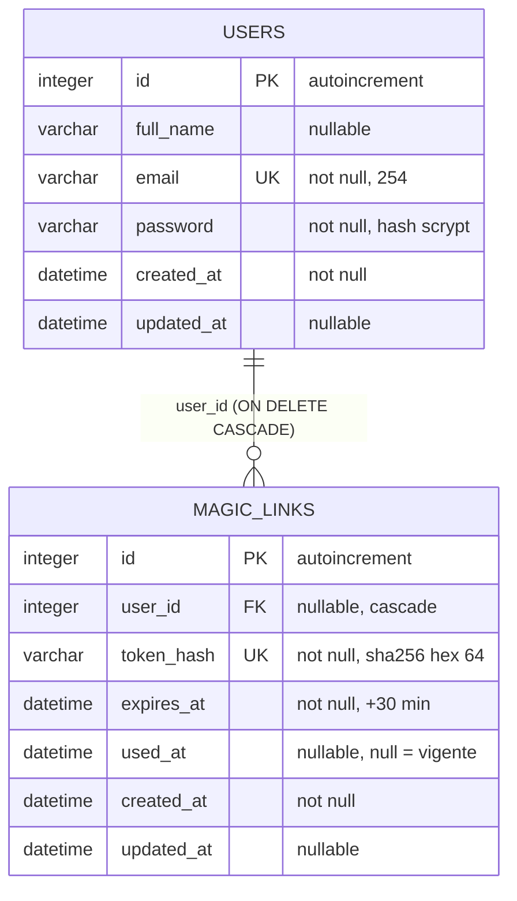
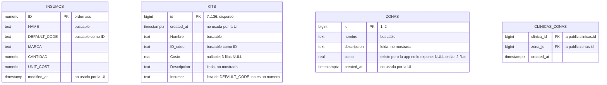
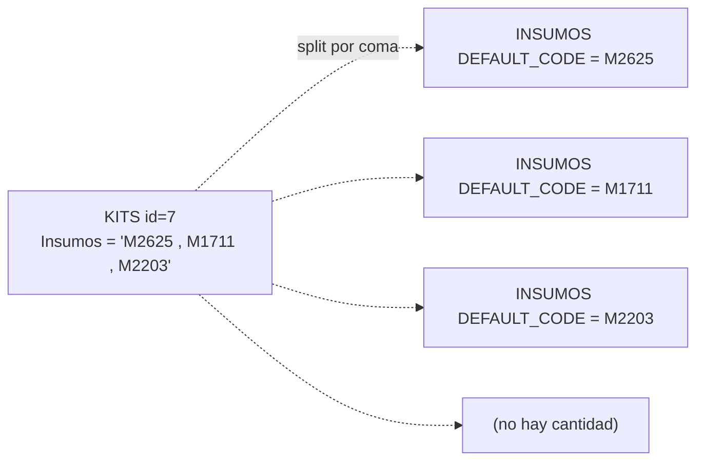
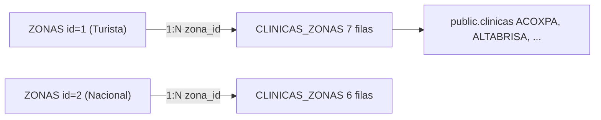
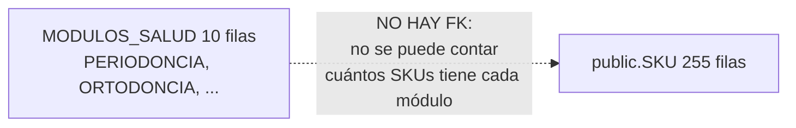

# Diagrama entidad-relación

## Control del documento

| Campo | Valor |
|---|---|
| Estado | ANALYZED |
| Responsable | Dev owner |
| Última actualización | 2026-09-30 |
| Versión relacionada | 2332e22 |

El modelo se divide en **dos bases de datos sin relación entre sí**. Por eso el diagrama se
presenta en dos bloques y no en un único grafo.

## Base de datos de autenticación (SQLite)

Leyenda: `PK` clave primaria, `FK` clave foránea, `UK` único.

### Cardinalidad
- Un `USERS` tiene 0..N `MAGIC_LINKS`. El cero es real: un usuario recién creado por `/signup`
  no tiene enlaces hasta que pide uno.
- Un `MAGIC_LINKS` pertenece a 0..1 `USERS` porque la columna es nullable en el esquema (aunque la
  aplicación siempre la escribe).

## Base de datos de catálogo (Supabase, solo lectura)

### Sin relación entre `INSUMOS` y `KITS`
No hay clave foránea. La composición de un kit se codifica **dentro del texto** de
`KITS."Insumos"`, como códigos separados por coma:

La consecuencia es que no se puede validar desde la base que un código exista, ni conocer la
cantidad de cada insumo. Esa información vive en `public."Kits"`, tabla desnormalizada con
`id_kit`, `id_insumo` y `Cantidad requerida numero`, que la aplicación todavía no consulta.

`INSUMOS` y `KITS` son **entidades aisladas**: no tienen claves foráneas hacia otras tablas de la
aplicación y no se relacionan con `USERS`.

### Relación real: `ZONAS` ↔ `CLINICAS_ZONAS`

A diferencia de insumos y kits, el catálogo de zonas **sí tiene una relación con FKs reales**
(verificadas en `information_schema`), aunque vive en el schema `public`:

- `public.clinicas_zonas.clinica_id → public."clinicas".id` y
  `public.clinicas_zonas.zona_id → public."zonas".id`. 13 filas, sin duplicados ni huérfanos.
- La app lee `dev."zonas"` (el `searchPath` pone `dev` primero; `public."zonas"` es un duplicado
  exacto) y **cuenta** las filas de `public.clinicas_zonas` por `zona_id` con una subconsulta
  correlacionada. No escribe en ninguna de las dos.
- Ojo: la FK de `zona_id` apunta a `public."zonas"`, no a `dev."zonas"`. Hoy son idénticas, pero
  son tablas distintas: si Odoo escribiera en una sola, el conteo y el listado podrían divergir.

### `MODULOS_SALUD`: entidad aislada, sin relación con los SKUs

- `dev.modulos_salud` **no tiene ninguna FK** que entre ni salga (verificado en
  `information_schema`). `public.modulos_salud` es un duplicado exacto, no una tabla de detalle.
- La referencia de diseño muestra el conteo de SKUs por módulo, pero **`public."SKU"` tampoco tiene
  columna ni FK hacia un módulo**: no hay forma de calcularlo. La pantalla muestra `0` como dato
  dummy (`SKUS_DUMMY` en el frontend), no un conteo real.
- Es la misma situación que `INSUMOS` y `KITS`: entidad aislada, sin FKs hacia otras tablas de la
  aplicación.

## Entidades que NO existen en el modelo

| Concepto de la UI | ¿Entidad? | Nota |
|---|---|---|
| SKU | **No** | Pantalla `skus` con props `{}` |
| Familia | **No** | Pantalla `familias` con props `{}` |
| Detalle de insumos por kit | **No** | Existe `public."Kits"` en Supabase (con cantidades), pero la app solo lee `dev."Kits"` |
| Usuario de negocio (del catálogo) | **No** | `users` es solo auth; la pantalla `usuarios` está vacía |
| Clínica | **No** | `public."clinicas"` existe y es el destino de la FK de `clinicas_zonas`, pero la app no la consulta |
| Sesión | **No** | `SESSION_DRIVER=cookie`: vive en una cookie cifrada, no en una tabla |

## Referencias
- [Diccionario de datos](data-dictionary.md)
- [Diseño de base de datos](database-design.md)
