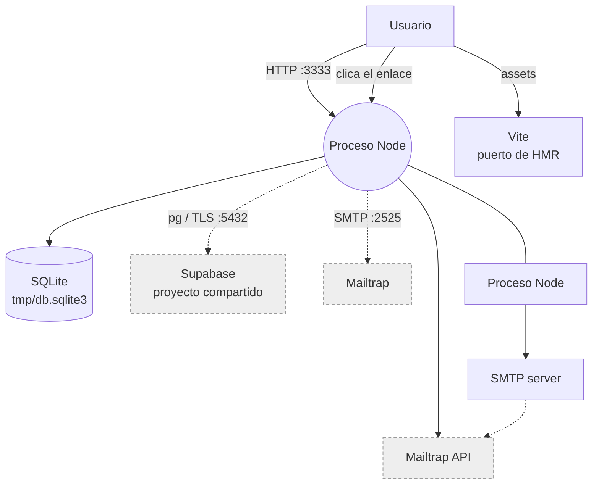

# Infraestructura

## Control del documento

| Campo | Valor |
|---|---|
| Estado | ANALYZED |
| Responsable | Dev owner |
| Última actualización | 2026-09-30 |
| Versión relacionada | `7bb5ecb` |

## Conclusión

**No hay infraestructura.** No hay directorio `infra/`, ni `.github/`, ni IaC, ni contenedores, ni
configuración de servidor. El sistema se ejecuta exclusivamente en la máquina del desarrollador con
`npm run dev`. Este documento describe lo que el código **necesitaría**, no lo que existe.

## Diagrama

Diagrama de lo que existe hoy. `┄┄` marca dependencias externas fuera del control del proyecto.

## Componentes

| Componente | Servicio | Propósito | Escalado | Datos |
|---|---|---|---|---|
| **Servidor HTTP** | Proceso Node único (`bin/server.ts`) | Sirve assets, renderiza Inertia y expone las 14 rutas | **No**: un solo proceso, sin réplicas | — |
| **Base de datos de auth** | SQLite en `tmp/db.sqlite3` (`better-sqlite3`) | `users`, `magic_links` | **No aplica**: archivo local | Correos, hashes, tokens hasheados |
| **Catálogo** | PostgreSQL en Supabase (`pg`) | Fuente de los insumos | **Externo**: no lo controla este proyecto | `dev."Insumos"`, ~5.060 filas (no reverificado) |
| **Correo** | SMTP de Mailtrap | Entregar el magic link | **Externo** | El token, en el cuerpo del correo |
| **Assets** | Vite 8 | Compilar React a `public/assets` | **No** | — |
| **Registro de rutas** | `.adonisjs/client/registry` | Tipos de rutas para el cliente | **No aplica**: artefacto de build | — |

## Lo que no existe

| Capa | Ausente | Consecuencia |
|---|---|---|
| Compute | NingunaVM, ni contenedor, ni servicio | Solo hay un proceso en una máquina |
| Red | Ningún proxy inverso, ni balanceador, ni DNS | Sin terminación TLS, sin `trustProxy` configurado |
| TLS | No hay certificado | HSTS y cookies `Secure` no se pueden activar |
| Datos | Ningún volumen persistente declarado | `tmp/db.sqlite3` se pierde con la máquina |
| Migraciones en despliegue | Ninguna | `migrations.paths: []` para Supabase; SQLite requiere `migration:run` manual |
| Redundancia | Ninguna | Un fallo de proceso es caída total |
| CI/CD | Ninguna | Despliegue manual, sin verificaciones automáticas |

## Supuestos de despliegue para PROD

Lo que habría que decidir si el sistema se pone en producción. Ninguno está implementado:

| Decisión | Opciones | Estado |
|---|---|---|
| Dónde corre | Plataforma serverless, contenedor, VM | **Sin decidir** |
| Terminación TLS | Proxy (Caddy/Nginx), o la plataforma | **Sin decidir** |
| `trustProxy` | Necesario si hay proxy, para que `Secure` y el protocolo se calculen bien | `config/app.ts` conserva el valor por defecto |
| Persistencia de SQLite | Un store de la plataforma, o migrar a Postgres | **Sin decidir**. Es el punto bloqueante: ver [environments.md](environments.md) |
| `SESSION_DRIVER` | `cookie` funciona; `database` **no** (no existe la tabla `sessions`) | `cookie` obligatorio |
| Process manager | PM2 (soportado: `app.managedByPm2`), systemd, o nada | **Sin decidir** |
| Copia de `APP_KEY` | Gestor de secretos de la plataforma | **Sin decidir** |
| `NODE_ENV` | **Obligatorio** `production`: sin él, CORS refleja cualquier origen con `credentials` | Ver [security-testing](../08-quality/security-testing.md) TC-SEC-002 |
| Assets | `npm run build` y servir `public/assets` | El comando existe |
| `metaFiles` | `resources/views/**/*.edge` y `public/**` se copian al build | Ya configurado en `adonisrc.ts` |

## Puertos

| Puerto | Servicio | Quién lo abre |
|---|---|---|
| `3333` | Servidor HTTP | `PORT` en `.env` |
| Dinámico | Vite (HMR) | Lo asigna Vite en DEV |
| `5432` | Salida a Supabase | node-postgres |
| `2525` | Salida a SMTP | Mailtrap |

## Referencias
- [Ambientes](environments.md)
- [Deployment](deployment.md)
- [Monitoreo](monitoring.md)
- [Política de backup](backup-policy.md)
- [Disaster recovery](disaster-recovery.md)
- [Integraciones](../03-architecture/integrations.md)
- [Contenedores](../03-architecture/containers.md)

## Brechas

- **No hay infraestructura**: la única "infraestructura" es la máquina del desarrollador.
- **No hay TLS**: sin él, el token del magic link viaja en claro por la red. Es la brecha más grave
  de este documento.
- **SQLite en disco local impide cualquier despliegue stateless**: es el obstáculo técnico principal
  para llegar a una plataforma serverless. Cualquier despliegue con disco efímero perdería las
  cuentas.
- **Sin réplicas ni balanceo**: no hay forma de tolerar la caída de un proceso, ni de escalar.
- **Sin `trustProxy` explícito**: si se despliega detrás de un proxy, las cookies `Secure` y la
  redirección pueden calcular mal el protocolo.
- **Sin definición de red**: no se sabe si el tráfico es interno o público.
- **Sin gestión de secretos en la plataforma**: el `.env` se despliegue como archivo, sin cifrar.
